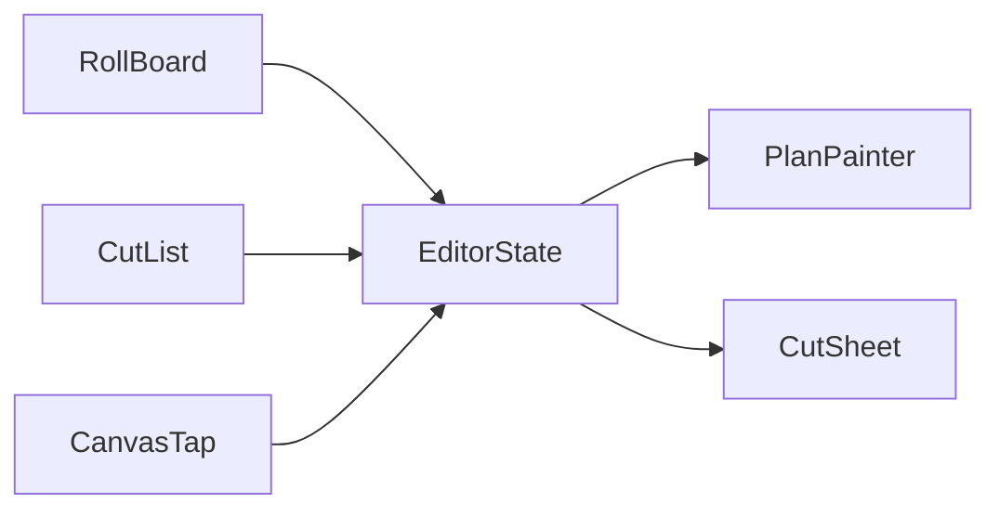

# Degrid — Project State

Last updated: 2026-07-03  
Latest commit on `main`: `d71b297` — bidirectional cut selection

Degrid is a Flutter floor-plan app for estimators and installers: draw rooms, assign carpet products, plan strip layouts and cuts, and visualize lay direction on the plan.

---

## Release flag

- [`lib/core/config/feature_flags.dart`](lib/core/config/feature_flags.dart): `kEnableCarpetFeatures = true` (dev)
- Carpet UI (cut sheet, room carpet assignment, per-cut arrows) is gated behind this flag
- See [`RELEASE_ANDROID.md`](RELEASE_ANDROID.md) before shipping

---

## Core app structure

| Area | Location |
|------|----------|
| Entry | `lib/main.dart`, `lib/app.dart` |
| Editor shell | `lib/ui/screens/editor_screen.dart` |
| Canvas | `lib/ui/canvas/plan_canvas.dart` (+ part files) |
| Editor ↔ canvas bridge | `lib/ui/editor/editor_controller.dart` |
| Projects list | `lib/ui/screens/projects_screen.dart` |
| Persistence | `lib/core/database/`, `lib/ui/canvas/plan_canvas_persistence.dart` |
| PDF export | `lib/core/export/pdf_export.dart` |

---

## Floor plan drawing

- Draw polygon rooms on a pannable/zoomable canvas (mm world space)
- Vertex editing, wall measurements, doors/openings
- Background image import + calibration
- Measure mode, add-dimension mode
- Undo/redo history
- Room selection, move (long-press / drag), delete
- Imperial/metric toggle, grid, wall width, door thickness (project settings)

---

## Room rotation

**Files:** `lib/core/geometry/room_transform.dart`, `lib/ui/canvas/plan_canvas_room_rotate.dart`

- Rotate handle (knob on stalk) above selected room’s top edge
- Drag to rotate with 15° snapping, sticky 90°, Shift for fine rotation
- Room actions menu: Rotate 90° CCW/CW, Rotate by angle…
- Openings synced on finish via `syncMirroredOpenings`
- Tests: `test/room_transform_test.dart`

---

## Room control layout

Controls are anchored to the room bounding box (not fixed pixel offsets from center):

| Control | Position |
|---------|----------|
| Rotate handle | Top-center, above room top edge |
| Three-dots menu | Top-right outside room |
| Name “+” button | Polygon area centroid (tap zone aligned) |

**Files:** `plan_canvas_room_management.dart`, `plan_canvas_geometry_helpers.dart`, `plan_canvas_tap.dart`

---

## Carpet planning

### Products & assignment

- Define carpet products (roll width, length, trim, pattern repeat, etc.) in `carpet_products_screen.dart`
- Assign product per room from the side panel
- Layout variant per room: Auto / 0° / 90°

### Strip layout engine

- `lib/core/roll_planning/roll_planner.dart` — strip computation, scoring, splitting
- `lib/core/roll_planning/room_strip_layout.dart` — shared `computeRoomStripLayout()` used by canvas, painter, cut list, cut sheet
- `lib/core/roll_planning/carpet_layout_options.dart` — waste %, seam penalties, strip split strategy
- Seam overrides (drag seams on canvas), along-run piece splits (cross-joins)
- Settings persisted per project (DB schema v13)

### Cut ID scheme

Shared helpers in [`lib/core/roll_planning/roll_plan_models.dart`](lib/core/roll_planning/roll_plan_models.dart):

- `formatCutId()` — `A1`, `A2`, or `A1-1` when a strip is split (cross-join)
- `roomLetterIndexInProduct()` — letter per room among same-product assignments
- `enumerateCutPieceAnchors()` — piece centers for drawing and hit-testing
- `CutPieceAnchor` — cutId, roomIndex, strip/piece index, world placement

Letter order matches cut sheet: rooms with carpet + valid layout, in assignment iteration order.

---

## Cut sheet & roll board

**File:** `lib/ui/screens/carpet_roll_cut_sheet.dart`

Bottom panel in editor (Cuts tab):

- **Cut list tab** — per-room strip/piece table (`carpet_cut_list_panel.dart`)
- **Roll cut tab** — scrollable roll board, cut blocks, inspector, auto-place, offcuts

Features:

- Horizontal scroll for long rolls (`minScalePxPerMm`, not squished to screen)
- Live sync while dragging seams on canvas (value-equality on layout inputs)
- Preserves roll-board placements when layout unchanged
- Planning settings dialog (waste %, seam penalties)
- Strip split strategy dropdown (Auto / one piece per strip / prefer split when long)
- Export CSV via native share sheet (`share_plus`), clipboard fallback when sharing unavailable

---

## Per-cut direction arrows

**File:** `lib/ui/canvas/plan_painter.dart`

- One lay-direction arrow per cut piece (every strip + every along-run sub-piece)
- Single-piece rooms: one arrow via `_drawCarpetRollArrow`
- Multi-piece rooms: `_drawPerPieceCarpetArrows` using `enumerateCutPieceAnchors`
- Cut ID label next to each arrow (plain text, offset from shaft)
- Concave/L-shaped rooms: placement samples along piece centerline if bbox center is outside polygon
- Skips arrows on pieces too small on screen; avoids room name centroid zone
- Along-run seam lines: dashed only (no duplicate arrows at seams)

---

## Bidirectional cut selection

**Latest feature** — select a cut in any view, highlight everywhere:



| Action | Cut | Room | Pan |
|--------|-----|------|-----|
| Tap cut on canvas | Select | Select room | No |
| Tap cut on roll board / cut list | Select | Select room | No |
| Tap room body | Clear cut | Select room | Existing |
| Tap empty canvas | Clear cut | Deselect | No |
| Inspector clear | Clear cut | Unchanged | No |

**State:** `EditorViewState.selectedCutId` → `PlanPaintModel.selectedCutId` → blue highlight (3px arrow, bold label)

**Files:**

- `lib/ui/canvas/plan_canvas_cut_selection.dart` — canvas hit test (~22px radius)
- `lib/ui/canvas/plan_canvas.dart` — `selectCut()`, `_selectedCutId`
- `lib/ui/editor/editor_controller.dart`
- `lib/ui/screens/editor_screen.dart` — wires cut sheet props
- `lib/ui/screens/carpet_cut_list_panel.dart` — tappable rows, full IDs (`A1-2`)

---

## Tests

| File | Covers |
|------|--------|
| `test/room_transform_test.dart` | Rotation geometry, angle snapping |
| `test/core/roll_planning/cut_id_test.dart` | `formatCutId`, letter index, `enumerateCutPieceAnchors` |
| `test/core/roll_planning/room_strip_layout_test.dart` | Shared layout helper, split strategies, waste |

Run: `flutter test`  
Analyze: `flutter analyze`

---

## Not implemented yet (ideas backlog)

**High value**

- Copy/paste rooms
- Job-level waste & material summary / quote totals
- PDF export including cut list

**Installer polish**

- Optional pan-to-cut on selection
- Lay sequence numbers
- Seam diagram export
- Pile-direction mismatch warnings

**Canvas**

- Mirror room
- Multi-select rooms
- Keyboard shortcuts (copy/paste, rotate)

---

## Quick manual test checklist

### Drawing & rooms
- [ ] Draw room, close polygon, name room
- [ ] Move room (long-press), rotate via handle and menu
- [ ] Controls don’t overlap on small/large/L-shaped rooms

### Carpet
- [ ] Assign product, open Cuts tab
- [ ] Multi-strip room shows strip seams + per-piece arrows
- [ ] Cross-join split shows `A1-1`, `A1-2` IDs
- [ ] Drag seam on canvas → cut list / roll board update live

### Cut selection
- [ ] Select cut on roll board → blue highlight on floor plan, viewport unchanged
- [ ] Tap cut label on canvas → roll board + inspector sync
- [ ] Tap cut list row → same highlight
- [ ] Tap elsewhere → cut highlight clears
- [ ] Two carpet rooms → `A…` / `B…` IDs consistent across all views

---

## Git history (recent)

```
d71b297 Link cut selection between roll board, cut list, and floor plan.
3668d21 Add room rotation and per-cut lay arrows with cut IDs on the floor plan.
b0bd89e Carpet planning: shared layout helper, live cut-sheet sync, adjustable & persisted settings
```
